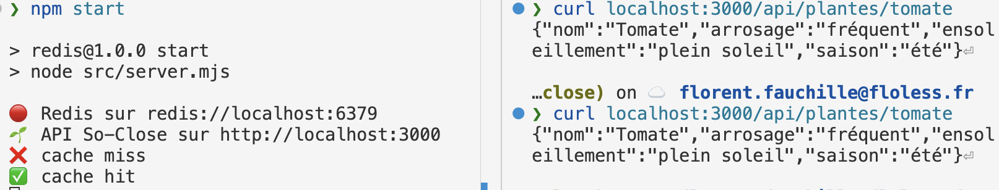

# TD — Bases de Données & So-Close

Ce projet contient les supports de TD pour manipuler plusieurs types de bases de données avec un jeu de données commun sur les jardins comestibles parisiens.

---

## 🧱 Objectif

- Comprendre les différences fondamentales entre modèles de données

Pour chaque moteur, vous devrez :

- Charger les données via des scripts `SQL` ou API spécifiques
- Explorer les données via des requêtes adaptées
- Répondre à des questions ciblées liées au projet So-Close

---

## Exemple de SGBD Relationnelle: 🐘 PostgreSQL

**Objectif**: Créer le schéma de base de so-close en utilisant un modèle relationnel.

### Configuration de PostgreSQL

1. Lancez le conteneur PostgreSQL :

```bash
docker compose up -d postgres
```

2. Vérfiez que vous pouvez vous connecter au shell PostgreSQL :

```bash
docker compose exec -it postgres psql -U so_close_user -d so_close_db

# Exemple d'output :
# psql (14.18 (Debian 14.18-1.pgdg120+1))
# Type "help" for help.

# so_close_db=#
```

> Note: pour quitter le shell PostgreSQL, tapez `\q`

### Chargement des données

À ce stade, la base de données est vide.

Voici les étapes pour charger les données :

1. **Générez les données** en suivant [les instructions dans le dossier script](scripts/README.md).
   - uniquement pour PostreSQL pour l'instant
2. **Créez les tables** en exécutant le script `scripts/create_tables.sql` :

```bash
docker compose exec -it postgres psql -U so_close_user -d so_close_db -f scripts/create_tables.sql
```

3. **Insérez les données** en exécutant le script `scripts/load_data.sql` :

```bash
docker compose exec -it postgres psql -U so_close_user -d so_close_db -f scripts/load_data.sql
```

4. **Vérifiez les données** avec une requête simple :

```bash
docker compose exec -it postgres psql -U so_close_user -d so_close_db -c "SELECT * FROM jardins LIMIT 10;"
```

### 🔎 Énigmes à résoudre

- `Q1:` Combien y-a-t-il de **plantes différentes** dans la base ?
- `Q2:` Combien de **jardins** ont été générés ?
- `Q3:` Combien de **strates** différentes sont présentes dans la table des plantes ?
- `Q4:` Quelle plante est cultivée dans le **plus grand nombre de jardins** ?
- `Q5:` Quels sont les **jardins ayant le plus de jardiniers** dans un rayon de 1 km autour du point (lat: `48.8566`, long: `2.3522`) ?

> Note: pour la dernière question, vous avez le choix:
>
> - **Option 1**: utiliser une function personnalisée SQL (par exemple `haversine`)

```sql
CREATE OR REPLACE FUNCTION haversine_distance(
    lat1 double precision, lon1 double precision,
    lat2 double precision, lon2 double precision
) RETURNS double precision AS $$
DECLARE
    r double precision := 6371; -- Rayon de la Terre en km
    dlat double precision := radians(lat2 - lat1);
    dlon double precision := radians(lon2 - lon1);
    a double precision;
    c double precision;
BEGIN
    a := sin(dlat / 2)^2 + cos(radians(lat1)) * cos(radians(lat2)) * sin(dlon / 2)^2;
    c := 2 * atan2(sqrt(a), sqrt(1 - a));
    RETURN r * c;
END;
$$ LANGUAGE plpgsql IMMUTABLE;
```

> et appeler la fonction dans une requête :
>
> ```sql
> SELECT * FROM jardins WHERE haversine_distance(latitude, longitude, 48.8566, 2.3522) <= 1;
> ```

> - **Option 2**: utiliser une extension PostgreSQL comme `postgis` pour les calculs géographiques

```sh
# Créez l'extension PostGIS
docker compose exec -it postgres psql -U so_close_user -d so_close_db -c "CREATE EXTENSION postgis;"
```

> Puis executez la requête suivante :

```sql
SELECT *
FROM jardins
WHERE ST_Distance(
  geography(ST_MakePoint(longitude, latitude)),
  geography(ST_MakePoint(2.3522, 48.8566))
) <= 2000; -- en mètres (2 km)
```

### Si rien ne va, et vous voulez tout recommencer

- Aïe, rien ne va plus ? Pas de panique, vous pouvez tout réinitialiser :

```bash
docker compose down -v
docker compose up -d postgres
```

---

## Exemple de SGBD Doumentaire: 🍃 MongoDB

**Objectif**: Utiliser MongoDB pour stocker des commentaires sur les différentes cultures.

### Configuration de MongoDB

1. Lancez le conteneur MongoDB :

```bash
docker compose up -d mongo
```

2. Vérifiez que vous pouvez vous connecter au shell MongoDB :

```bash
docker compose exec -it mongo mongosh --username so_close_user --password so_close_password
```

### Chargement des données

À ce stade, la base de données est vide.
Voici les étapes pour charger les données :

1. **Générez les données pour MongoDB** en suivant [les instructions dans le dossier script](scripts/README.md#génération-de-données-pour-mongodb-generate_cultures_commentspy).
2. **Insérez les données** en utilisant `mongoimport`

```bash
docker compose exec -it mongo mongoimport --username=so_close_user --password=so_close_password --db=so_close
_db --authenticationDatabase=admin --collection=commentaires --file=/data/commentaires.json --jsonArray

# Vous devriez voir un message indiquant le nombre de documents insérés
# Par exemple:
# 2025-07-08T09:38:10.018+0000    connected to: mongodb://localhost/
# 2025-07-08T09:38:13.018+0000    [###########.............] so_close_db.commentaires     66.0MB/137MB (48.3%)
# 2025-07-08T09:38:16.018+0000    [#######################.] so_close_db.commentaires     131MB/137MB (95.9%)
# 2025-07-08T09:38:16.306+0000    [########################] so_close_db.commentaires     137MB/137MB (100.0%)
# 2025-07-08T09:38:16.307+0000    284613 document(s) imported successfully. 0 document(s) failed to import.
```

3. **Vérifiez les données** avec une requête simple :

```bash
docker compose exec -it mongo mongosh --username so_close_user --password so_close_password

# Dans le mongo shell
use so_close_db
db.commentaires.find().limit(10).pretty()
```

> Plus d'informations sur `mongosh` dans la [documentation officielle](https://www.mongodb.com/docs/mongodb-shell/crud/read/)

#### 🔎 Énigmes à résoudre

1. Trouvez tous les commentaires pour la plante avec l'ID `8`
1. Top 5 des plantes les plus commentées (regardez la fonction `aggregate` de MongoDB)
1. Le jardin le plus commenté (regardez la finction `aggregate` de MongoDB et `$unwind`)

Que notez vous comme différences entre MongoDB et PostgreSQL ?

---

## Exemple de SGBD Colonne: 🧱 Cassandra

**Objectif**: Utiliser une base orientée colonnes (Cassandra) pour stocker les récoltes agricoles dans le temps, et optimiser les requêtes d’analyse.

### Configuration de Cassandra

1. Lancez le conteneur Cassandra (depuis le dossier racine du projet) :

```bash
docker compose up -d cassandra
```

> Note: Cassandra peut prendre un peu de temps pour démarrer, soyez patient.

2. Assurez vous que vous pouvez vous connecter au shell Cassandra

```bash
# ré-essayez plusieurs fois si nécessaire, cassandra peut prendre 1 à 2 minutes à démarrer
docker compose exec -it cassandra cqlsh
```

### Chargement des données

À ce stade, la base de données est vide.
Voici les étapes pour charger les données :

1. **Générez les données pour Cassandra** en suivant [les instructions dans le dossier script](scripts/README.md#génération-de-données-pour-cassandra-generate_cultures_recoltespy).
2. **Créez le "schéma" (en réalité un ["keyspace"]())** en exécutant le script
   `cql/create_keyspace.cql` :

```bash
docker compose exec -it cassandra cqlsh -f /cql/create_keyspace.cql
```

3. **Créez les tables** en exécutant le script `cql/create_tables.cql` :

```bash
docker compose exec -it cassandra cqlsh -f /cql/create_tables.cql
```

4. **Insérez les données** en exécutant le script `cql/load_data.cql` :

```bash
docker compose exec -it cassandra cqlsh -f /cql/load_data.cql
```

### 🔎 Énigmes à résoudre

1. Lister les récoltes du jardin 12 sur les 3 dernières années
2. Comparer les quantités de menthe entre 2023 et 2024
3. Comptez la quantité de récolte tout confondue pour le jardin 12 sur l'année 2024

### Différences avec un modèle relationnel et Cassandra

> Vous vous posez peut-être la question : Pourquoi plusieurs tables `cultures_par_jardin` et `cultures_par_plante` ?
>
> 🔎 Chaque table est conçue pour répondre à une seule requête typique (ex. : "recoltes par jardin", "recoltes par plante").
>
> ✅ Les données sont dupliquées volontairement dans plusieurs tables.
>
> ⚙️ C’est l’application (backend, script Python…) qui assure la cohérence entre les tables lors des insertions.

Les points suivants comparent la logique de modélisation relationnelle classique avec la modélisation spécifique à Cassandra, afin d’aider à penser différemment.

> Note: ces conclusions sont directement résumées de [la documentation officielle de Cassandra](https://cassandra.apache.org/doc/latest/cassandra/developing/data-modeling/data-modeling_rdbms.html)

#### 🔄 Pensée relationnelle (SQL)

**Dans une base relationnelle classique :**

- On normalise les données (plusieurs tables liées par des clés étrangères)
- On utilise des jointures pour reconstruire les vues nécessaires
- Le schéma est centré sur les données, pas les requêtes

Exemple :

- Une table utilisateurs
- Une table commandes
- Une table produits

→ Requête de reporting = plusieurs JOIN

#### 🔁 Pensée Cassandra (NoSQL orientée colonnes)

**Dans Cassandra :**

- Pas de jointures
- Les requêtes guident la structure des tables
- On duplique les données dans plusieurs tables adaptées à des requêtes précises
- On privilégie des écritures rapides, pour des lectures ciblées

#### 🧠 Changement de paradigme

| Relationnel                      | Cassandra                              |
| -------------------------------- | -------------------------------------- |
| Schéma basé sur les entités      | Schéma basé sur les cas d’usage        |
| Normalisation                    | Dénormalisation                        |
| Accès via requêtes dynamiques    | Accès prévisibles et indexés           |
| Relations inter-tables           | Regroupement de données dans une table |
| Transactions complexes possibles | Requêtes simples et rapides            |

#### 📌 Conclusion (de la doc Cassandra)

- Pensez à l’envers : quelles sont les requêtes ?
- Créez une table par requête
- Acceptez la duplication pour gagner en performance
- Structurez vos données autour de la clé de partition et de l’ordre des clustering keys
- Anticipez vos accès, car il n’y a pas de requête universelle possible

---

## Exemple de SGBD Graph: 🌿 Neo4j

**Objectif**: Explorer les connexions. Trouver les utilisateurs proches selon leurs pratiques et leurs plantes.

### Configuration de Neo4j

1. Lancez le conteneur Neo4j :

```bash
docker compose up -d neo4j
```

2. Vérifiez que vous pouvez vous connecter à l'interface web de Neo4j :
   http://localhost:7474

3. Connectez-vous avec les identifiants par défaut (dans le [`docker-compose.yml`](docker-compose.yml)) :
   - **Utilisateur** : `neo4j`
   - **Mot de passe** : `so_close_password`

### Chargement des données

À ce stade, la base de données est vide.

Nous n'allons pas utiliser de fichier CSV pour charger les données dans Neo4j, mais plutôt un script Python.

Voici les étapes pour charger les données :

1. **Générez et inserez les données pour Neo4j** en suivant [les instructions dans le dossier script](scripts/README.md#génération-et-insertion-de-données-pour-neo4j-seed_neo4j_so_closepy).

2. **Vérifiez les données** sur l'interface web de Neo4j en exécutant la requête suivante dans le navigateur :

```cypher
MATCH (u:Utilisateur)
RETURN u.nom AS Nom, size((u)-[:CULTIVE]->(:Plante)) AS Nombre_de_plantes
ORDER BY Nombre_de_plantes DESC
LIMIT 10;
```

### 🔎 Énigmes à résoudre

1. Jardiniers qui ont au moins 2 plantes en commun

```cypher
MATCH (a:Utilisateur)-[:CULTIVE]->(p:Plante)<-[:CULTIVE]-(b:Utilisateur)
WHERE a.nom < b.nom
WITH a, b, count(p) AS nb_communes
WHERE nb_communes >= 2
RETURN a.nom, b.nom, nb_communes
ORDER BY nb_communes DESC
```

2. Calculer la “distance” entre deux jardiniers (nombre de sauts), par exemple entre `Jardinier 1` et `Jardinier 42`

```cypher
MATCH (a:Utilisateur {nom: "Jardinier 1"}), (b:Utilisateur {nom: "Jardinier 42"}),
path = shortestPath((a)-[:CULTIVE*]-(b))
RETURN length(path) AS distance
```

3. Suggérer des binômes compatibles

```cypher
MATCH (u1:Utilisateur)-[:CULTIVE]->(p:Plante)<-[:CULTIVE]-(u2:Utilisateur)
WHERE u1.nom < u2.nom
WITH u1, u2, count(p) AS affinite
WHERE affinite >= 3
RETURN u1.nom, u2.nom, affinite
ORDER BY affinite DESC
```

### À retenir

**Pourquoi Neo4j ici plutôt que PostgreSQL ?**

| 🔍 Requête                       | PostgreSQL                          | Neo4j                             |
| -------------------------------- | ----------------------------------- | --------------------------------- |
| Relations croisées entre nœuds   | Requêtes très complexes avec JOIN   | Requête naturelle et performante  |
| Recherches de voisins/connexions | Auto-jointures récursives complexes | `shortestPath` direct             |
| Suggérer des binômes             | CTE (table récursive), agrégats     | Requêtes en 1 ligne               |
| Ajout de contexte au lien        | `table relationnelle` + attributs   | Ajout direct sur `[:CULTIVE {…}]` |

**Neo4j est bien plus adapté pour :**

- les relations multi-niveaux (graphe de co-cultures),
- les navigations de proximité (voisins, suggestions),
- les connexions implicites entre utilisateurs.

---

## Exemple de SGBD Clé Valeur: 🧠 Redis

**Objectif**: Utiliser Redis pour mettre en cache des fiches de plantes

**Démarche**:

Mettre en cache les réponses de l’API `/api/plantes/:nom` dans Redis afin de :

- Améliorer la vitesse de réponse utilisateur
- Réduire les appels inutiles au backend ou à la base de données

### Configuration de Redis

1. Lancez le conteneur Redis :

```bash
docker compose up -d redis
```

2. Vérifiez que vous pouvez vous connecter au shell Redis :

```bash
docker compose exec -it redis redis-cli
```

### Lancer le web service

1. Dans le dossier `redis`:

```bash
# si vous avez nvm installé sinon
# utilisez la version de node dans le fichier.nvmrc
nvm use
npm install
npm start
```

### Cache hit et cache miss

Sur deux terminaux différents, vous pouvez tester le cache :

```bash
# Terminal 1 : Lancer le serveur si ce n'est pas déjà fait
# cd redis/
npm start

# Terminal 2 : Faire une requête
curl http://localhost:3000/api/plantes/tomate
# puis la refaire une seconde fois
curl http://localhost:3000/api/plantes/tomate
```

Vous devriez voir dans le terminal du serveur :



### Vider le cache

Pour vider le cache, vous pouvez appeler l'endpoint `/admin/clear-cache` :

```bash
curl http://localhost:3000/admin/clear-cache
# Réponse : 🗑 Cache vidé.
```

### Visualiser les clés dans Redis CLI

```bash
docker exec -it soclose-redis redis-cli

# Dans le shell Redis CLI
## A remplacer en fonction des requetes que vous avez faites
> KEYS plante:*
> GET plante:tomate
> TTL plante:tomate
```

### 💡 Concepts introduits

| Concept             | Description                                             |
| ------------------- | ------------------------------------------------------- |
| Cache-aside pattern | Lecture du cache avant fallback vers la DB              |
| TTL (Time To Live)  | Expiration automatique des données en cache (`EX 3600`) |
| Prefixing des clés  | Organisation des entrées Redis (`plante:<nom>`)         |
| Gain de performance | Temps de réponse réduit grâce au cache Redis            |

---

### Si vous souhaitez aller plus loin

- Ajouter un middleware pour chronométrer le temps de réponse
- Simuler une latence avec `setTimeout` dans `getPlanteFromDb()`
